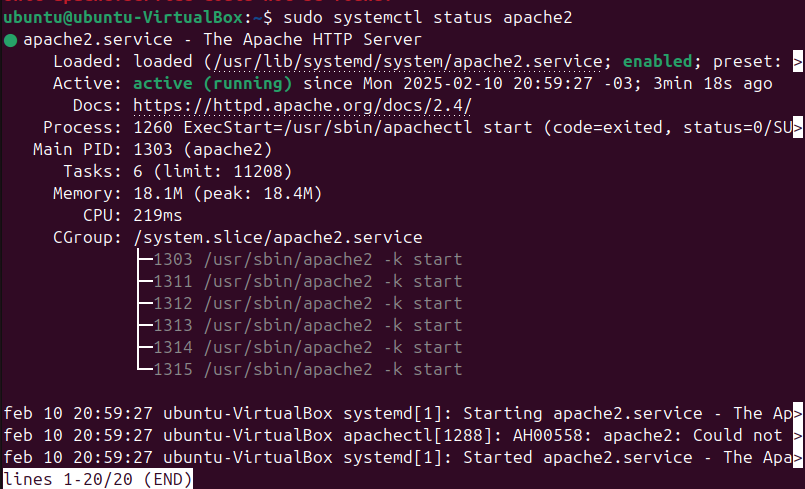
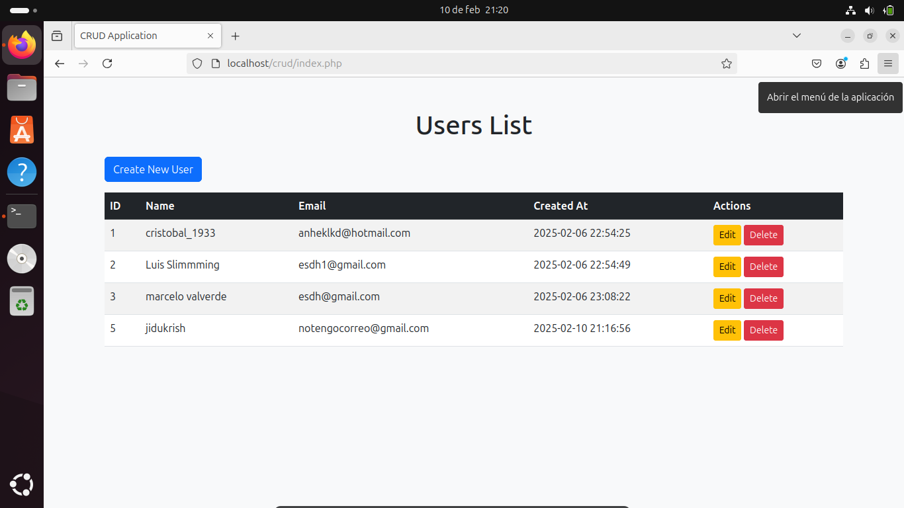

## Descripción

Crear un servidor web con Apache, conectarlo a una base de datos y desarrollar una aplicación web sencilla que implemente un CRUD (Create, Read, Update, Delete) implica varios pasos, este ejemplo se hizo en una maquina Ubuntu y se trabajo principalmente por terminal:

### 1. **Instalar Apache, PHP y MySQL**

Primero, necesitas actualizar los paquetes del sistema e instalar Apache, PHP y MySQL en tu servidor. Si estás en un sistema basado en Debian/Ubuntu, puedes hacerlo con los siguientes comandos:

```bash
sudo apt update && sudo apt upgrade -y
sudo apt install apache2
sudo apt install mysql-server
sudo apt install php libapache2-mod-php php-mysql
```

### 2. **Configurar Apache**

Una vez instalado Apache, asegúrate de que el servicio esté en ejecución:

```bash
sudo systemctl start apache2
sudo systemctl enable apache2
sudo systemctl status apache2
```



Puedes verificar que Apache esté funcionando accediendo a `http://localhost` en tu navegador. Deberías ver la página de inicio de Apache.

### 3. **Configurar MySQL**

Configura MySQL y crea una base de datos y un usuario para tu aplicación:

```bash
sudo mysql_secure_installation
```

El comando **`sudo mysql_secure_installation`** es una herramienta de seguridad incluida en MySQL y MariaDB que ayuda a configurar opciones básicas de seguridad en una instalación nueva. Se ejecuta con privilegios de administrador (`sudo`) para realizar cambios en el servidor de bases de datos.

---

1. **Configurar el plugin VALIDATE PASSWORD**  
   Permite establecer reglas de complejidad para contraseñas de usuarios (ej: longitud, caracteres especiales).

2. **Cambiar la contraseña del usuario `root`**  
   Obliga a definir una contraseña segura para la cuenta root de MySQL (si no está configurada).

3. **Eliminar usuarios anónimos**  
   Borra cuentas sin nombre de usuario, que podrían ser un riesgo.

4. **Deshabilitar el acceso remoto para `root`**  
   Restringe el usuario `root` a conexiones locales (evita accesos desde fuera del servidor).

5. **Eliminar la base de datos `test`**  
   Borra una base de datos de prueba que viene por defecto y puede ser vulnerable.

6. **Recargar privilegios**  
   Aplica los cambios inmediatamente.

---

### **Recomendaciones al usarlo**

1. **Contraseña segura para `root`**

   - Usa una contraseña compleja (mínimo 12 caracteres, mezcla mayúsculas, números y símbolos).
   - Si activas el plugin `VALIDATE PASSWORD`, elige el nivel de seguridad adecuado:
     - `0`: Bajo (solo verifica longitud).
     - `1`: Medio (longitud + mezcla de caracteres).
     - `2`: Fuerte (exige mayor complejidad).

2. **Eliminar usuarios anónimos**  
   A menos que tengas un caso de uso específico, responde **Sí** (`Y`) para borrarlos.

3. **Restringir acceso remoto de `root`**

   - Si el servidor MySQL solo se usa localmente (ej: una aplicación en el mismo servidor), responde **Sí** (`Y`).
   - Si necesitas acceso remoto como `root`, crea un usuario dedicado con permisos específicos en su lugar.

4. **Eliminar la base de datos `test`**  
   Responde **Sí** (`Y`) a menos que la estés usando activamente.

5. **Copia de seguridad previa**  
   Si ya tienes bases de datos en uso, realiza un backup antes de ejecutar el comando:

   ```bash
   sudo mysqldump -u root -p --all-databases > backup.sql
   ```

6. **No uses `root` para aplicaciones**  
   Crea usuarios con permisos limitados para cada base de datos o servicio:

   ```sql
   CREATE USER 'app_user'@'localhost' IDENTIFIED BY 'contraseña-segura';
   GRANT SELECT, INSERT, UPDATE ON basedatos.* TO 'app_user'@'localhost';
   ```

7. **Actualizaciones**  
   Asegúrate de tener la última versión de MySQL/MariaDB para corregir vulnerabilidades:
   ```bash
   sudo apt update && sudo apt upgrade mysql-server
   ```

---

### **Ejemplo de flujo típico**

```bash
$ sudo mysql_secure_installation

Securing the MySQL server deployment.

Enter password for user root: [Si ya existe, ingrésala; si no, déjalo vacío]
Would you like to setup VALIDATE PASSWORD plugin? [Y] Y
Please enter 0 = LOW, 1 = MEDIUM, 2 = STRONG: 2
New password: [*******]
Re-enter new password: [*******]
Remove anonymous users? [Y/n] Y
Disallow root login remotely? [Y/n] Y
Remove test database and access to it? [Y/n] Y
Reload privilege tables now? [Y/n] Y
```

---

### **Notas adicionales**

- Si olvidas la contraseña de `root`, deberás reiniciar MySQL en modo seguro para resetearla.
- En entornos cloud (AWS RDS, Google Cloud SQL), algunas opciones están gestionadas por el proveedor.

Luego, accede a MySQL y crea una base de datos y un usuario:

```bash
sudo mysql -u root -p password
```

Dentro de MySQL crearemos una base de datos sencilla:

```sql
CREATE DATABASE crud_db;
CREATE USER 'crud_user'@'localhost' IDENTIFIED BY 'password';
GRANT ALL PRIVILEGES ON crud_db.* TO 'crud_user'@'localhost';
FLUSH PRIVILEGES;
EXIT;
```

### 4. **Crear la estructura de la base de datos**

Crea una tabla en la base de datos para almacenar los datos. Por ejemplo, una tabla `users`:

```sql
USE crud_db;

CREATE TABLE users (
    id INT AUTO_INCREMENT PRIMARY KEY,
    name VARCHAR(100) NOT NULL,
    email VARCHAR(100) NOT NULL UNIQUE,
    created_at TIMESTAMP DEFAULT CURRENT_TIMESTAMP
);
```

### 5. **Crear la aplicación web CRUD**

Ahora que tenemos la base de datos lista crearemos una aplicación web sencilla en PHP que implemente un CRUD.

#### Estructura de archivos recomendada:

Estos archivos los crearemos en la carpeta /var/html/ en esta crearemos la carpeta crud.

```
/var/www/html/crud/
│
├── index.php          # Listar usuarios
├── create.php         # Crear un nuevo usuario
├── edit.php           # Editar un usuario existente
├── delete.php         # Eliminar un usuario
└── db.php             # Conexión a la base de datos
```

Estos archivos son la forma mas sencilla de hacerlo, al principio no se implementan validaciones o sistemas de desinfección de entradas, los nombres de base de datos, user y password deben ser los que se definieron en un principio.

#### `db.php` (Conexión a la base de datos):

```php
<?php
$host = 'localhost';
$db   = 'crud_db';
$user = 'crud_user';
$pass = 'password';

$conn = new mysqli($host, $user, $pass, $db);

if ($conn->connect_error) {
    die("Connection failed: " . $conn->connect_error);
}
?>
```

#### `index.php` (Listar usuarios):

```php
<?php
include 'db.php';

$sql = "SELECT * FROM users";
$result = $conn->query($sql);
?>

<!DOCTYPE html>
<html>
<head>
    <title>CRUD Application</title>
</head>
<body>
    <h1>Users List</h1>
    <a href="create.php">Create New User</a>
    <table border="1">
        <tr>
            <th>ID</th>
            <th>Name</th>
            <th>Email</th>
            <th>Created At</th>
            <th>Actions</th>
        </tr>
        <?php while($row = $result->fetch_assoc()): ?>
        <tr>
            <td><?php echo $row['id']; ?></td>
            <td><?php echo $row['name']; ?></td>
            <td><?php echo $row['email']; ?></td>
            <td><?php echo $row['created_at']; ?></td>
            <td>
                <a href="edit.php?id=<?php echo $row['id']; ?>">Edit</a>
                <a href="delete.php?id=<?php echo $row['id']; ?>" onclick="return confirm('Are you sure?')">Delete</a>
            </td>
        </tr>
        <?php endwhile; ?>
    </table>
</body>
</html>
```

#### `create.php` (Crear usuario):

```php
<?php
include 'db.php';

if ($_SERVER['REQUEST_METHOD'] == 'POST') {
    $name = $_POST['name'];
    $email = $_POST['email'];

    $sql = "INSERT INTO users (name, email) VALUES ('$name', '$email')";
    if ($conn->query($sql) === TRUE) {
        header("Location: index.php");
        exit();
    } else {
        echo "Error: " . $sql . "<br>" . $conn->error;
    }
}
?>

<!DOCTYPE html>
<html>
<head>
    <title>Create User</title>
</head>
<body>
    <h1>Create New User</h1>
    <form method="POST">
        <label for="name">Name:</label>
        <input type="text" id="name" name="name" required>
        <br>
        <label for="email">Email:</label>
        <input type="email" id="email" name="email" required>
        <br>
        <button type="submit">Create</button>
    </form>
    <a href="index.php">Back to List</a>
</body>
</html>
```

#### `edit.php` (Editar usuario):

```php
<?php
include 'db.php';

if ($_SERVER['REQUEST_METHOD'] == 'POST') {
    $id = $_POST['id'];
    $name = $_POST['name'];
    $email = $_POST['email'];

    $sql = "UPDATE users SET name='$name', email='$email' WHERE id=$id";
    if ($conn->query($sql) === TRUE) {
        header("Location: index.php");
        exit();
    } else {
        echo "Error: " . $sql . "<br>" . $conn->error;
    }
}

$id = $_GET['id'];
$sql = "SELECT * FROM users WHERE id=$id";
$result = $conn->query($sql);
$row = $result->fetch_assoc();
?>

<!DOCTYPE html>
<html>
<head>
    <title>Edit User</title>
</head>
<body>
    <h1>Edit User</h1>
    <form method="POST">
        <input type="hidden" name="id" value="<?php echo $row['id']; ?>">
        <label for="name">Name:</label>
        <input type="text" id="name" name="name" value="<?php echo $row['name']; ?>" required>
        <br>
        <label for="email">Email:</label>
        <input type="email" id="email" name="email" value="<?php echo $row['email']; ?>" required>
        <br>
        <button type="submit">Update</button>
    </form>
    <a href="index.php">Back to List</a>
</body>
</html>
```

#### `delete.php` (Eliminar usuario):

```php
<?php
include 'db.php';

$id = $_GET['id'];
$sql = "DELETE FROM users WHERE id=$id";

if ($conn->query($sql) === TRUE) {
    header("Location: index.php");
    exit();
} else {
    echo "Error: " . $sql . "<br>" . $conn->error;
}
?>
```

### 6. **Probar la aplicación**

Accede a tu aplicación web desde el navegador:

```
http://localhost/crud/index.php
```

Desde aquí, podrás crear, leer, actualizar y eliminar usuarios en la base de datos.

### 7. **Consideraciones de seguridad**

Este ejemplo es básico y no incluye medidas de seguridad avanzadas como la validación de entradas, la protección contra SQL injection o la autenticación de usuarios. En un entorno de producción, es crucial implementar estas medidas.

### Mejorar el diseño:



### 1. **Incluir Bootstrap en tu proyecto**

Bootstrap se puede incluir en tu proyecto añadiendo su CDN (Content Delivery Network) en el `<head>` de tus archivos HTML/PHP. Esto te permite usar los estilos y componentes de Bootstrap sin necesidad de descargar archivos.

Agrega esto en el `<head>` de tus archivos PHP:

```html
<!-- Bootstrap CSS -->
<link href="https://cdn.jsdelivr.net/npm/bootstrap@5.3.0/dist/css/bootstrap.min.css" rel="stylesheet" />
<!-- Bootstrap Icons -->
<link href="https://cdn.jsdelivr.net/npm/bootstrap-icons@1.10.5/font/bootstrap-icons.css" rel="stylesheet" />
```

Y esto antes de cerrar el `</body>`:

```html
<!-- Bootstrap JS y dependencias -->
<script src="https://cdn.jsdelivr.net/npm/@popperjs/core@2.11.6/dist/umd/popper.min.js"></script>
<script src="https://cdn.jsdelivr.net/npm/bootstrap@5.3.0/dist/js/bootstrap.min.js"></script>
```

---

Ejemplo mejoramiento de diseño en los archivos:

### 2. **Diseño mejorado para `index.php` (Listar usuarios)**

```php
<?php
include 'db.php';

$sql = "SELECT * FROM users";
$result = $conn->query($sql);
?>

<!DOCTYPE html>
<html lang="es">
<head>
    <meta charset="UTF-8">
    <meta name="viewport" content="width=device-width, initial-scale=1.0">
    <title>CRUD Application</title>
    <!-- Bootstrap CSS -->
    <link href="https://cdn.jsdelivr.net/npm/bootstrap@5.3.0/dist/css/bootstrap.min.css" rel="stylesheet">
</head>
<body class="bg-light">
    <div class="container mt-5">
        <h1 class="text-center mb-4">Users List</h1>
        <a href="create.php" class="btn btn-primary mb-3">
            <i class="bi bi-plus-circle"></i> Create New User
        </a>
        <table class="table table-striped table-hover">
            <thead class="table-dark">
                <tr>
                    <th>ID</th>
                    <th>Name</th>
                    <th>Email</th>
                    <th>Created At</th>
                    <th>Actions</th>
                </tr>
            </thead>
            <tbody>
                <?php while($row = $result->fetch_assoc()): ?>
                <tr>
                    <td><?php echo $row['id']; ?></td>
                    <td><?php echo $row['name']; ?></td>
                    <td><?php echo $row['email']; ?></td>
                    <td><?php echo $row['created_at']; ?></td>
                    <td>
                        <a href="edit.php?id=<?php echo $row['id']; ?>" class="btn btn-sm btn-warning">
                            <i class="bi bi-pencil"></i> Edit
                        </a>
                        <a href="delete.php?id=<?php echo $row['id']; ?>" class="btn btn-sm btn-danger" onclick="return confirm('Are you sure?')">
                            <i class="bi bi-trash"></i> Delete
                        </a>
                    </td>
                </tr>
                <?php endwhile; ?>
            </tbody>
        </table>
    </div>
</body>
</html>
```

---

### 3. **Diseño mejorado para `create.php` (Crear usuario)**

```php
<?php
include 'db.php';

if ($_SERVER['REQUEST_METHOD'] == 'POST') {
    $name = $_POST['name'];
    $email = $_POST['email'];

    $sql = "INSERT INTO users (name, email) VALUES ('$name', '$email')";
    if ($conn->query($sql) === TRUE) {
        header("Location: index.php");
        exit();
    } else {
        echo "Error: " . $sql . "<br>" . $conn->error;
    }
}
?>

<!DOCTYPE html>
<html lang="es">
<head>
    <meta charset="UTF-8">
    <meta name="viewport" content="width=device-width, initial-scale=1.0">
    <title>Create User</title>
    <!-- Bootstrap CSS -->
    <link href="https://cdn.jsdelivr.net/npm/bootstrap@5.3.0/dist/css/bootstrap.min.css" rel="stylesheet">
</head>
<body class="bg-light">
    <div class="container mt-5">
        <h1 class="text-center mb-4">Create New User</h1>
        <div class="card shadow">
            <div class="card-body">
                <form method="POST">
                    <div class="mb-3">
                        <label for="name" class="form-label">Name:</label>
                        <input type="text" class="form-control" id="name" name="name" required>
                    </div>
                    <div class="mb-3">
                        <label for="email" class="form-label">Email:</label>
                        <input type="email" class="form-control" id="email" name="email" required>
                    </div>
                    <button type="submit" class="btn btn-primary">
                        <i class="bi bi-save"></i> Create
                    </button>
                    <a href="index.php" class="btn btn-secondary">
                        <i class="bi bi-arrow-left"></i> Back to List
                    </a>
                </form>
            </div>
        </div>
    </div>
</body>
</html>
```

---

### 4. **Diseño mejorado para `edit.php` (Editar usuario)**

```php
<?php
include 'db.php';

if ($_SERVER['REQUEST_METHOD'] == 'POST') {
    $id = $_POST['id'];
    $name = $_POST['name'];
    $email = $_POST['email'];

    $sql = "UPDATE users SET name='$name', email='$email' WHERE id=$id";
    if ($conn->query($sql) === TRUE) {
        header("Location: index.php");
        exit();
    } else {
        echo "Error: " . $sql . "<br>" . $conn->error;
    }
}

$id = $_GET['id'];
$sql = "SELECT * FROM users WHERE id=$id";
$result = $conn->query($sql);
$row = $result->fetch_assoc();
?>

<!DOCTYPE html>
<html lang="es">
<head>
    <meta charset="UTF-8">
    <meta name="viewport" content="width=device-width, initial-scale=1.0">
    <title>Edit User</title>
    <!-- Bootstrap CSS -->
    <link href="https://cdn.jsdelivr.net/npm/bootstrap@5.3.0/dist/css/bootstrap.min.css" rel="stylesheet">
</head>
<body class="bg-light">
    <div class="container mt-5">
        <h1 class="text-center mb-4">Edit User</h1>
        <div class="card shadow">
            <div class="card-body">
                <form method="POST">
                    <input type="hidden" name="id" value="<?php echo $row['id']; ?>">
                    <div class="mb-3">
                        <label for="name" class="form-label">Name:</label>
                        <input type="text" class="form-control" id="name" name="name" value="<?php echo $row['name']; ?>" required>
                    </div>
                    <div class="mb-3">
                        <label for="email" class="form-label">Email:</label>
                        <input type="email" class="form-control" id="email" name="email" value="<?php echo $row['email']; ?>" required>
                    </div>
                    <button type="submit" class="btn btn-warning">
                        <i class="bi bi-pencil"></i> Update
                    </button>
                    <a href="index.php" class="btn btn-secondary">
                        <i class="bi bi-arrow-left"></i> Back to List
                    </a>
                </form>
            </div>
        </div>
    </div>
</body>
</html>
```

---
